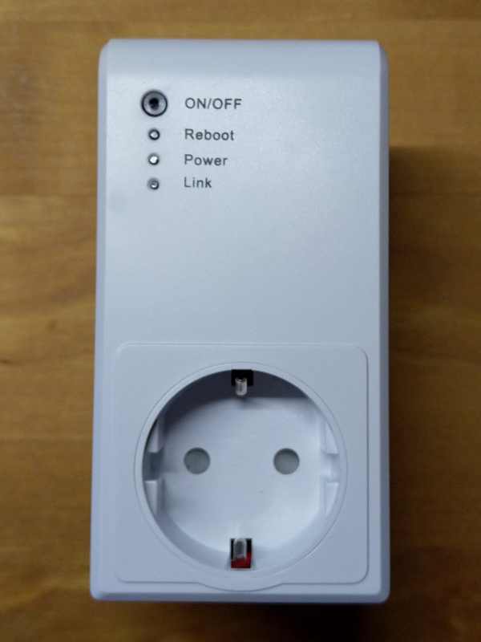
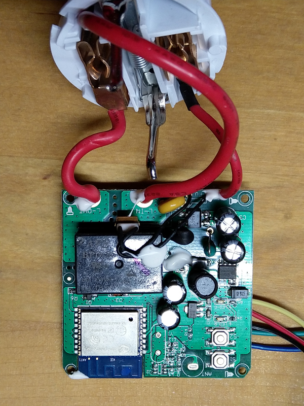
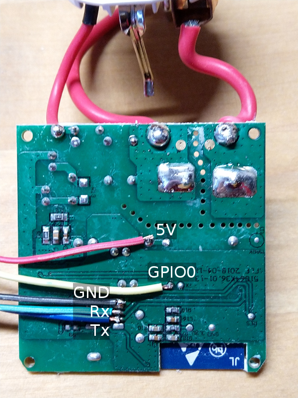
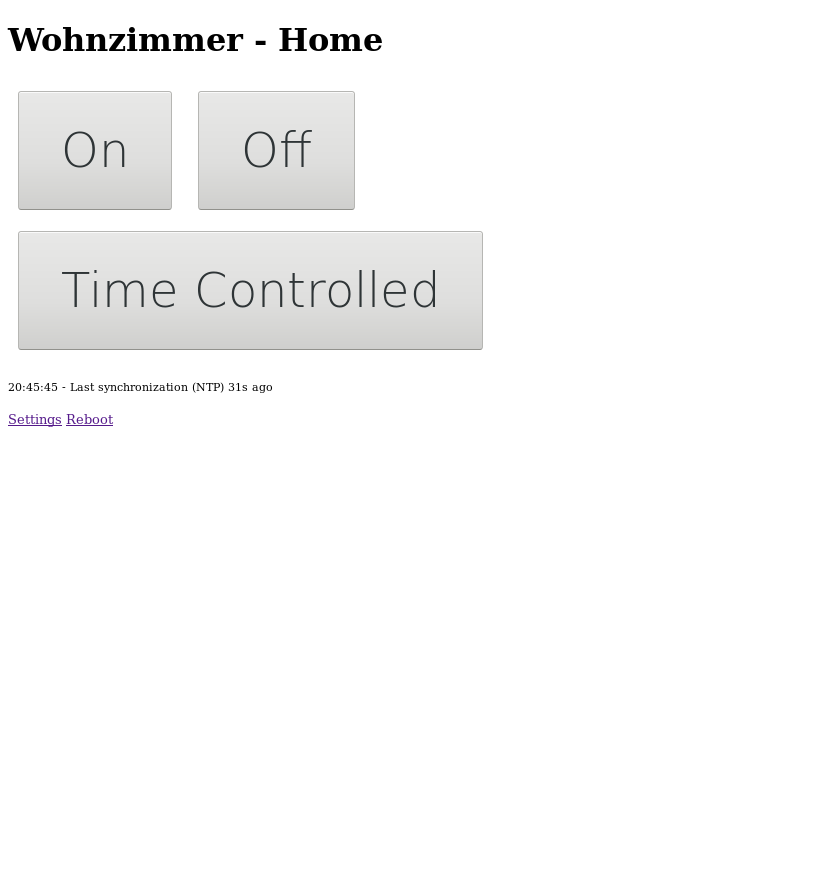
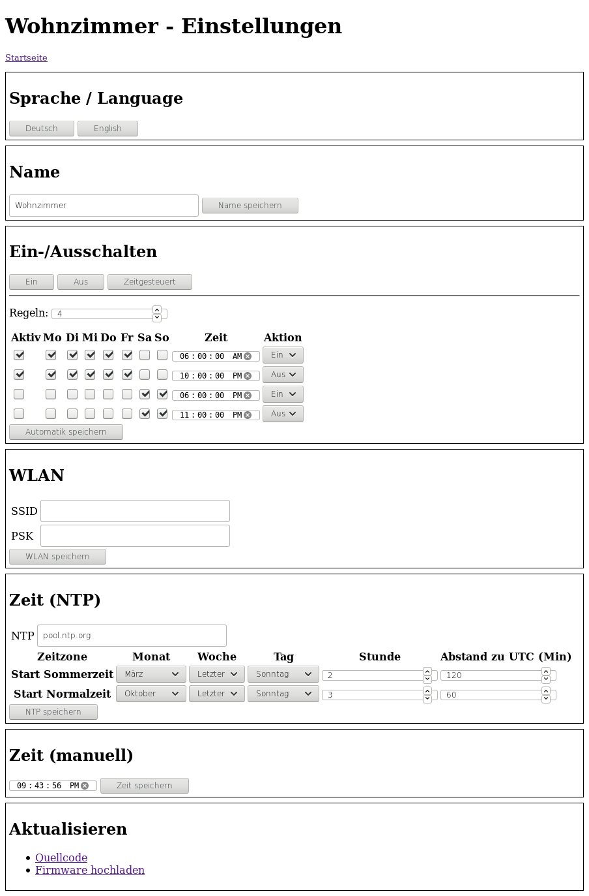

<h1>Firmware for OBI's WIFI Socket Version 2 with ESP8266 WROOM-02</h1>

The WIFI Socket is sold by OBI for 9.99EUR (or two for 17.99EUR) in April 2019

This firmware provides a simple web interface to controll the WiFi Socket. There are several other projects around which also free the socket from Chinese servers and integrate it in a smart home environment or connect it to an MQTT server. If you want to do this you better look there.

<h2>The usual warnings</h2>

DO NOT open the case unless you know what you are doing. 240V can kill you. 
NEVER connect the socket to mains while open. 
DO NOT expose  the socket to the internet. The socket stores your WiFi credentials and supports remote updates.

<h2>Features</h2>
<ul>
  <li>No external Server needed - No App needed - Managed from any Web Browser</li>
  <li>Manual and time triggered On/Off</li>
  <li>Uses NTP for time synchronization</li>
  <li>Converts from UTC to local time and DST</li>
  <li>OTA update</li>
</ul>

<h2>Used Libraries</h2>
<ul>
  <li>Arduino 1.8.9</li>
  <li><a href="https://github.com/esp8266/Arduino">Arduino Core for ESP8266 2.5.0</a></li>
</ul>

<h2>Prepare the Hardware</h2>
<ol>
  <li>To open the case you need a 3 wing screw driver. The screws inside holding the PCB are cross head screws.</li>
  <li>Attach the wires to the PCB as shown in the image below (click to enlage):
    <ul>
      <li>Red: 5V (the relay won't work with 3.3V)</li>
      <li>Black: GND</li>
      <li>Yellow: GPIO0, must be pulled to GND on RESET when flashing</li>
      <li>Green: Rx, 3.3V level, connect to Tx of the serial adapter</li>
      <li>Blue: Tx, 3.3V level, connect to Rx of the serial adapter</li>
    </ul>
  </li>
</ol>

  
  

<h2>Prepare the Software</h2>
<ol>
  <li>Open the Arduino IDE</li>
  <li>Install the required libraries</li>
  <li>Check the <a href="source/ArduinoSettings.png">Board Settings</a> in the Tools menu</li>
  <li>Modify the password.h file, the password is used in AP mode and as OTA update password</li>
  <li>Load the EspObiSocket.ino sketch</li>
  <li>Connect GPIO0 to GND and press the Reset button</li>
  <li>Flash the ESP8266 using Arduino IDE </li>
</ol>

<h2>First Start</h2>
<ol>
  <li>Open the Serial Monitor in Arduino IDE</li>
  <li>Power on / reset the WiFi Socket</li>
  <li>Connect to the Network with the SSID "WiFiSocket-xxxxxx" and the password specified in the password.h file (both are shown in the Serial Monitor)</li>
  <li>Open the web page "http://192.168.4.1" (or sometimes 192.168.244.1)</li>
  <li>On the Settings page enter the credentials (SSID and PSK) of your WiFi network and press "save"</li>
  <li>The WiFi Socket will now connect to your network</li>
  <li>Check your router for the network address of the WiFi Socket and open the settings page in the browser to check the other parameters</li>
  <li>At next power on the WiFi Socket will remember the settings</li>
</ol>

<h2>Usage of the WiFi Socket</h2>
<ul>
  <li>The WiFi Socket always starts in "Off" position.</li>
  <li>When switching to ON or OFF the "Time Controlled" mode is disabled.</li>
</ul>

<h2>Using the hardware buttons</h2>
<ul>
  <li>Reset: Restart the WiFi Socket.</li>
  <li>On/Off: Rotate from OFF to "Time Controlled" to ON and back to OFF.</li>
</ul>

<h2>LEDs</h2>
<ul>
  <li>Red OFF: Socket has no power</li>
  <li>Red ON: Socket has power</li>
  <li>Green OFF: manual mode</li>
  <li>Green ON: Time Controlled mode</li>
  <li>Green blink: Time Controlled mode Error, e.g. no NTP server found</li>
</ul>

<h2>UI Screenshots</h2>

